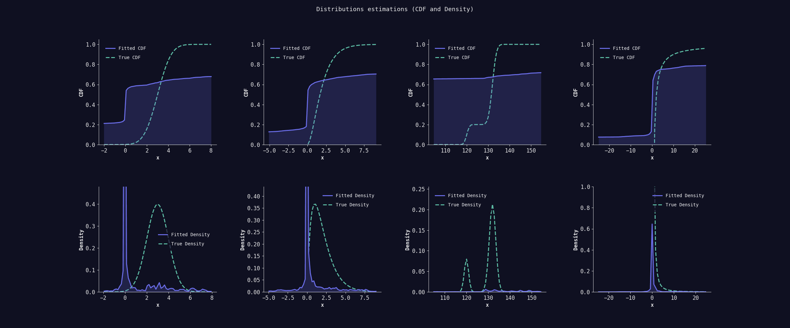

# SICK BIDE: A New Paradigm for distribution modeling
SICK BIDE introduces an innovative paradigm for representing and working with complex distributions. At its core:

* BIDE (Binary Implicit Distribution Encoding): A neural network layer that takes the binary representation of any data—such as numbers (e.g., float16) or categories (e.g., uint16)—and predicts its relative likelihood (logit). By working directly with binary encodings, BIDE can model distributions over virtually anything that can be encoded in binary form.

* SICK (Softmax Integral Compute Kernel): A GPU-optimized kernel that leverages modern GPU features, to compute probabilities efficiently. Instead of approximations, SICK performs "brute-force" computation of the normalization constant required for softmax.

This paradigm has wide-reaching applications, from improving the way we process tabular data and time series to redefining how we model embeddings for AI systems like large language models (LLMs). By integrating SICK BIDE into your workflows, you can explore new possibilities for working with data in its most fundamental binary form.

👉 For more insights join the [DuonLabs community on telegram](https://t.me/DuonLabs)

# Applications of SICK BIDE

## Modelling continuous distributions
Currently, to model a continuous distribution, you either need use a parametric distribution which limits the flexibility of the model or discretize the continuous space. Both methods have their limitations. SICK BIDE provides an in-between solution that keeps the best of both worlds: the expressiveness of categorical distributions over a continuous space.

## Low-memory vocabulary distributions
Large language models (LLMs) like GPTs or Llamas uses embeddings to compute a categorical distribution over the vocabulary. These embeddings are typically large and memory-intensive. SICK BIDE can be used to model conditional vocabulary distribution in a more memory-efficient way.

# Methods

## BIDE
BIDE is a neural network layer that takes binary input and predicts the logit of the likelihood of the input. It is composed of two layers: a linear layer followed by a ReLU activation function. The output of the second layer is the logit of the likelihood of the input. By leveraging binary input, BIDE model implicitly the distribution over the input space.

## SICK
SICK is a GPU-optimized kernel that computes the integrals needed for the computation of BIDE. This include the normalization constant for the softmax computation in the forward pass. But SICK is also used in the backward pass to compute the gradients of the loss with respect to the model parameters. You can seee how it's possible in the [backward pass of the fused NLL loss and softmax kernel](docs/sick_nll_kernel_bwd.md).

👉 For more insights join the [DuonLabs community on telegram](https://t.me/DuonLabs)
